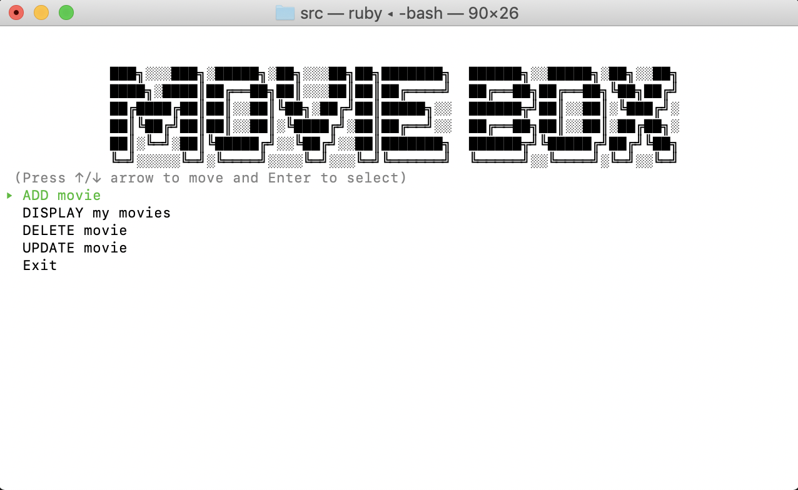
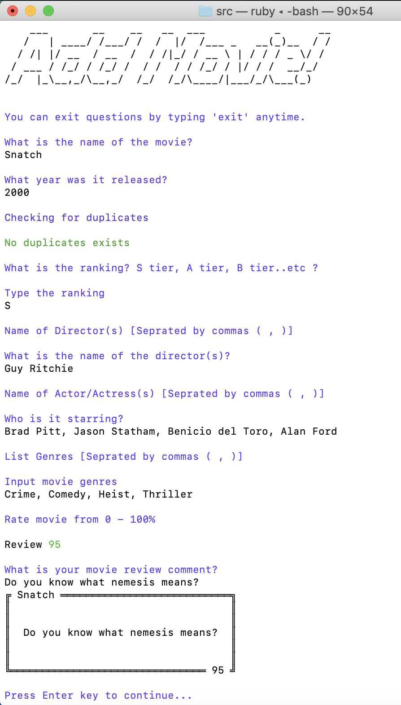
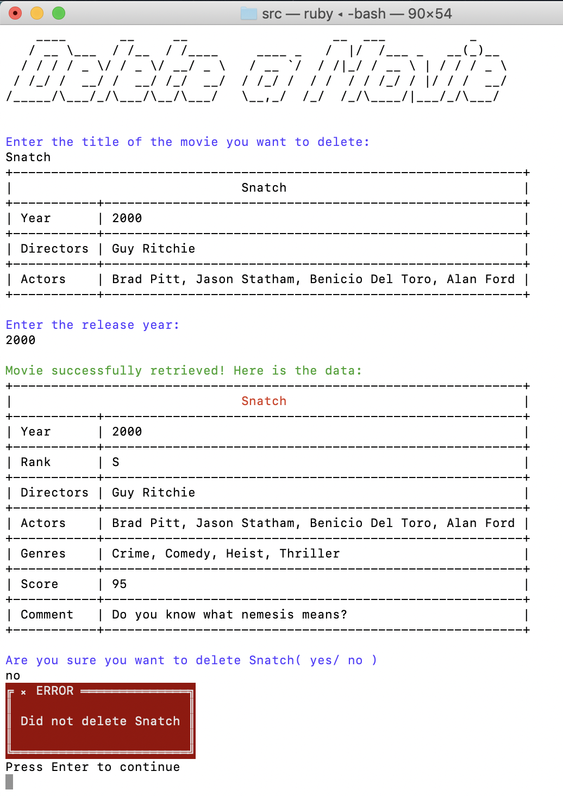
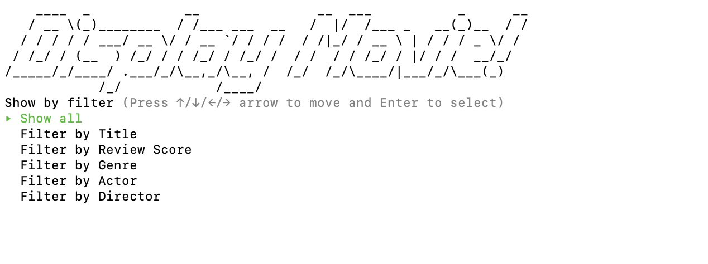
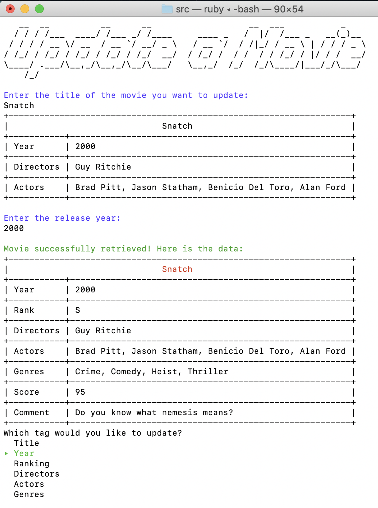
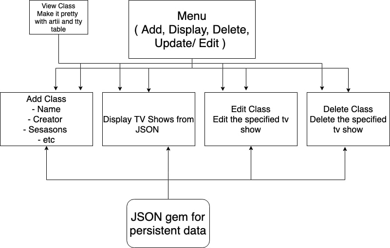
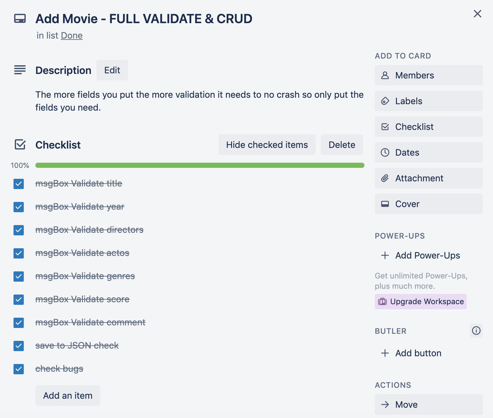
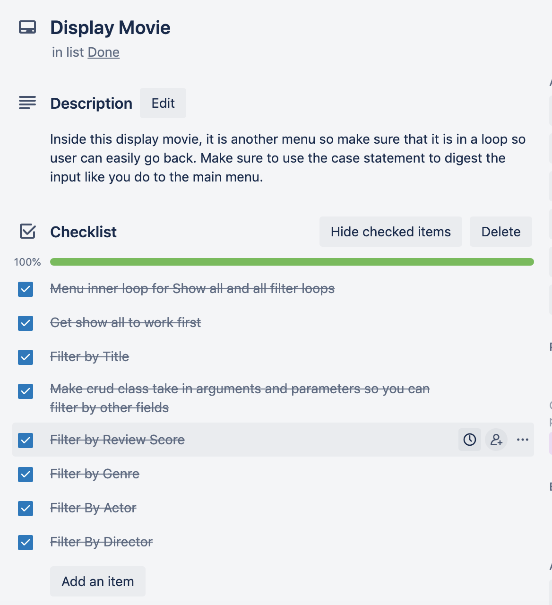
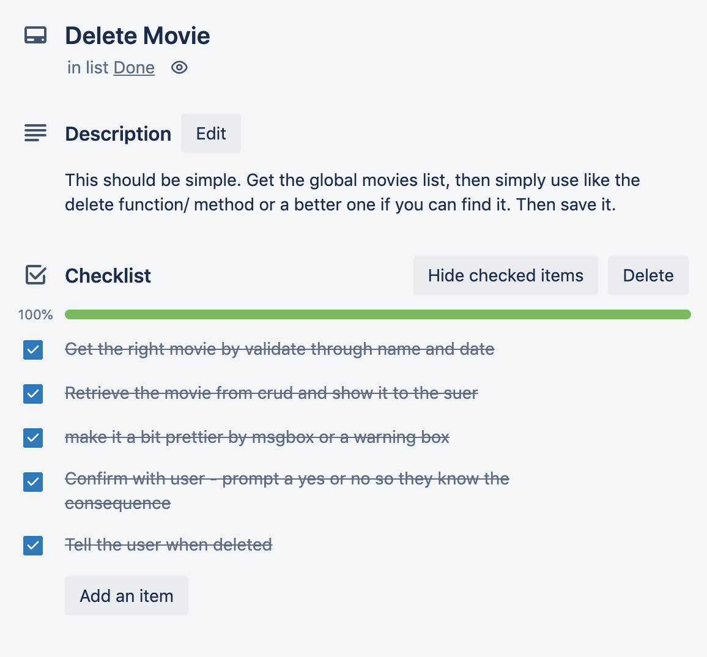
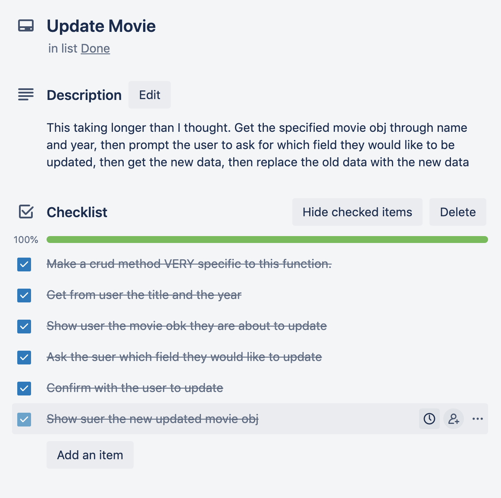

# Movie Box Ruby CLI Application

MovieBox is a ruby powered CLI app that allows users to catalogue and record all the movies they have seen. It allows them to add, delete and update the movie data and offers a dynamic way to filter and view them.

## How to run the app

 

**0. System Requirements**

 

Make sure you have Ruby installed because this is a ruby app.
One way to install it easily is [asdf](https://asdf-vm.com/#/).

**1. Download MovieBox:**

The Link to download is
https://github.com/thangzathang/MovieBox

Git clone it or download the ZIP of the app to your machine/ laptop.

 

**2. Install ruby gem dependencies:**

Ensure you have Ruby bundler installed, then, install all the required ruby gem by typing `bundle install` in the terminal of your src folder.

 

**3. Run MovieBox:**
You will need to be in the src folder to execute code.
You will most likely need execution permission from bash, use the following code `chmod +x ./movieBox.sh` to gain this permission. 
After that, type `./movieBox.sh` and the program will execute.

 

**4. Help**

Type the command`./mybooks.sh --help` to display help message.

 

# Software Development Plan

## Purpose

The purpose of my terminal app is to allow users the ability to store / save the movies they have seen. It will allow them to store it in a data format data for persistent data. They can add and delete movies as they please. They will also be given comprehensive data sorting functionality so that they may sort through the movies they have watched and use it as a tool to re-watch certain they loved. 

 

### Problems it will solve

1. It is an app they can conveniently use to store their movies on the go on the terminal line which programmers use a lot.
1. Offers a very basic but important details of movies that can sometimes be a hassle to remember. Details such as release year, all the directors, all the actors, the score they gave or the interesting thing they loved which they can put in the comments. Essentially is a personalized encyclopedia.  
1. People like to re-watch certain movies because of various reasons such as nostalgia or pure boredom - a behaviour observed during the 2020 - 2021 Covid lock-downs. This app allows for people to filter movies through actors, directors, genres and movie scores they gave in the past, such are the factors that are most considered when deciding what to watch. This app will help people decide what to re watch when lonely and bored - it can potentially pass off as a 'self-care' terminal app.

 

### Target Audience

Avid movie lovers is the target audience for this app. Movie watchers with slight or intense case of OCD will now be able to properly store and catalogue their movies on the go on the terminal. They can use this app as a one stop shop to decide what movie they want to re-watch with their partner/ friends.
 

## Features

### ***Feature 1: CRUD Implementation***
 

The heart of this application is CRUD. The main menu of this app is Add Movies, Display Movies, Delete Movies and Update Movies. These options presented to the user does precisely what it says to the user. 

 

We can add and delete movies - this is saved to the JSON data file and can be just as easily be deleted from the JSON data file. These are checks when adding to check for duplicate content on a user level, and there are confirmation prompts to confirm user decisions when deleting data from the data base.

 

The display ( Read / Retrieve ) offers addition options to the reader by allowing the user to show all the movies in the data base or filter the movies by the fields they filled out earlier such as actor, director, genres and movie score. 

 

)
Finally, the update functionality allows the user to change the data they have inputted earlier so that if they have changed their mind or simply made a mistake, they can rectify it easily as they have added.

 

### ***Feature 2: JSON data persistency***
 
The JSON gem is a powerful tool for data persistency. When the program exits or user has decided to be done with it, the data is saved externally to an outside JSON file. This means when the user comes back on the program, all their data is saved and they can view their entries from last usage. 

JSON does require a certain level of delicacy as to interact with JSON, it requires file reading which almost certainly means try and catch error handling. Read from JSON file is like any other file format with the need convert to json when saving data, and the need to parse JSON when reading from it. I believe I had handle it appropriately so the user does not need to worry about such crash or bugs.

### ***Feature 3: Ruby gems for fun and dynamic interface***

The terminal app is visually adequate and very simple and minimalist. It is done by design through the help of ruby gems such as the 'tty-prompt', 'tty-box', 'terminal table', 'Rainbow' and 'Artii'. They have been integrated to give user a fun and simple user experience. 

 

## User Interaction and Experience Outline

1. All menu navigation should intuitive because users will understand the scroll up and down selection. The ***tty-prompt*** gem is used to achieve this ease of use. User must simply scroll up or down and press enter to access and execute each menu features as told by the prompt which is provided by tty-prompt. 

1. They can always go back to previous page by finding the 'Exit' option which will always be present. Users can opt out of any prompted features by typing in 'exit' in most cases. 

1. Error handling is done very well in this app because the app will prevent any errors from occurring in the first place because of the custom built 'messageBox' class which it's entire purpose is to prevent errors. Error handling usually means the programs halts - never fun for the user so I have decided to prevent errors occurring altogether except in the case of File reading. MessageBox is very comprehensive in the way it deals prevents errors using 'tty-box' and 'Rainbow' colours to show the user what they must do to proceed to the next step.

 

## Control Flow Diagram

 

## Implementation Plan

 

We were told to ***Trello*** project management platform.

The link to my Trello Board for this project is: https://trello.com/b/fapOKfqO/movie-termina-app

All 4 Main CRUD features and their checklist can be seen in the screenshot

While there were complications along the coding, the main steps I needed to take were very obvious because of this trello board.

 

## Testing

### 1. Testing All CRUD Feature
Precondition: There is a book called "Clean Code" in the library with its reading status set to "Reading".

***Scenario 1***
1. Open the app.
1. From the main menu, select "Access My Library".
1. From the reading status menu, select "Reading".
1. Under the book list table, select "Select Book".
1. After being prompted to enter the book title, try not to enter anything and hit enter.

Expectation: The app is giving an error message "Value must be provided".

***Scenario 2***
1. Open the app.
1. From the main menu, select "Access My Library".
1. From the reading status menu, select "Reading".
1. Under the book list table, select "Select Book".
1. Enter Title: "Clean Code".
1. Under the book metadata, select "Delete Book"
1. After being prompted a warning message, enter "y" to confirm the deletion.

Expectation: "Clean Code" should be deleted and no longer in the library.

***Scenario 3***
1. Open the app.
1. From the main menu, select "Access My Library".
1. From the reading status menu, select "Reading".
1. Under the book list table, select "Select Book".
1. Enter Title: "Clean Code".
1. Under the book metadata, select "Change Reading Status".
1. From the reading status menu, select "Read".

Expectation: "Clean Code" should be gone in the "Reading" list and be moved to the "Read" list.

### 2. Test Search Feature

***Scenario 1***

Precondition: There are few books with different formats(Paperbook/Kindle/Audiobook/eBook/Other) in the library.

1. Open the app.
1. From the main menu, select "Search For Books".
1. From the search filter menu, select "Format".
1. From the format menu, select "Kindle"

Expectation: The app is showing only those books with "Kindle" format.

***Scenario 2***

Precondition: There is no book in the library.

1. Open the app.
1. From the main menu, select "Search For Books".
1. From the search filter menu, try to select any option.
1. After being prompted "There is no book in your library. Do you want to add a book? (Y/n) ", enter "y".

Expectation: The app is taking the user to the library screen and offering list options.

### Referenced sources 

[tty-prompt 0.23.0](https://rubygems.org/gems/tty-prompt)

[artii 2.1.2](https://rubygems.org/gems/artii/versions/2.1.2)

[json 2.5.1](https://rubygems.org/gems/json/versions/2.5.1)

[terminal-table 3.0.0](https://rubygems.org/gems/terminal-table)

[rainbow 3.0.0](https://rubygems.org/gems/rainbow)

